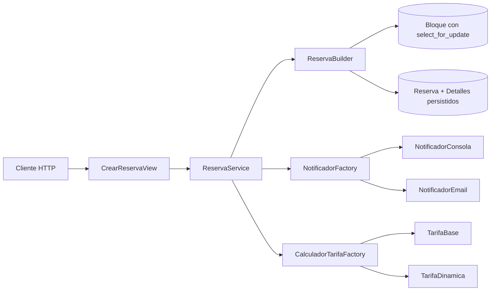
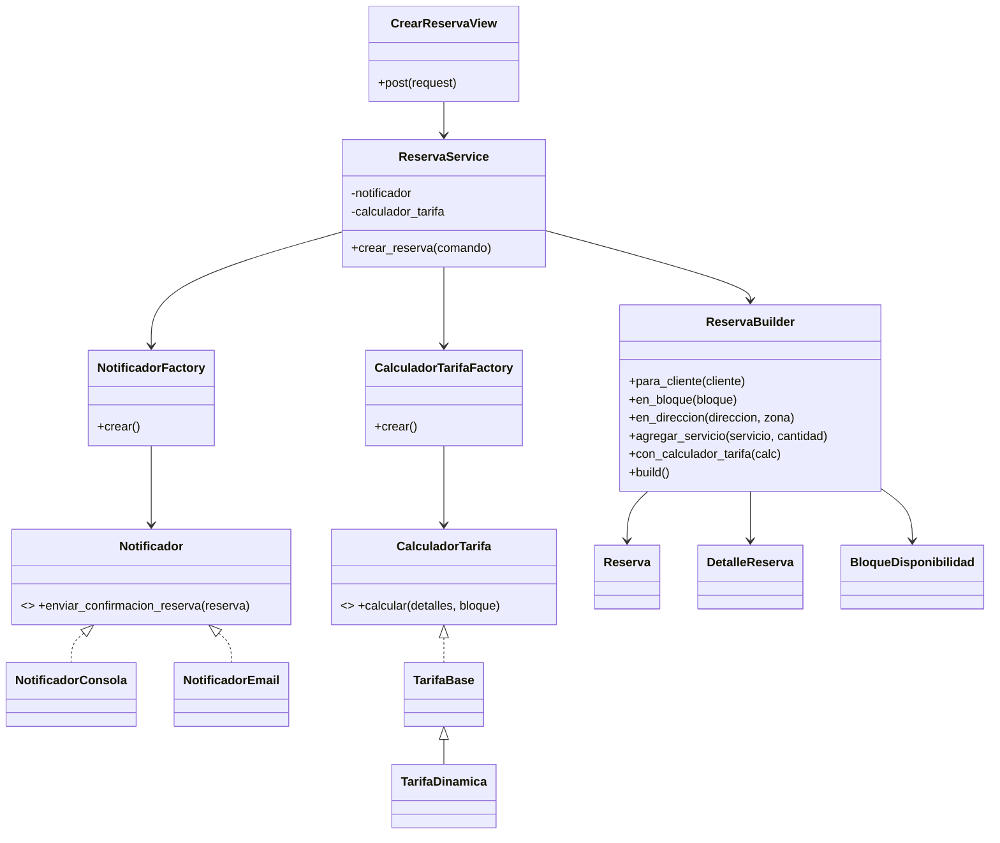

# Implementación del Patrón Creacional

## Módulo: creación de reservas

### Problema

La creación de una reserva reúne reglas que no deberían permanecer dentro de una vista:

- validar que el bloque siga libre y pertenezca al profesional correcto (RN-01);
- comprobar que todos los servicios pertenezcan al mismo profesional (RN-02);
- verificar que el profesional esté verificado y cubra la zona del cliente (RN-07);
- verificar que los servicios quepan en la duración del bloque;
- congelar el precio y la duración de cada servicio en la línea de detalle;
- calcular el total con la estrategia de tarifa vigente;
- guardar la reserva, sus detalles y ocupar el bloque en una sola transacción;
- notificar la creación.

Una vista con todas estas decisiones tendría demasiados `if/else`, acceso directo a la base de datos y responsabilidades mezcladas.

## Solución arquitectónica

### 1. Capa de interfaz

`CrearReservaView` recibe el JSON, identifica al usuario autenticado, arma el comando y llama a `ReservaService`. Traduce el resultado o la excepción de dominio a una respuesta HTTP.

La vista no conoce cómo se calcula el total, cómo se validan los servicios, cómo se bloquea la agenda ni qué implementación de notificación se usa. Tiene 12 líneas.

### 2. Service Layer

`ReservaService` representa el caso de uso **Crear Reserva**. Sus responsabilidades son de orquestación, no de validación:

1. resolver cliente, bloque y servicios a partir de los ids del comando;
2. armar el `ReservaBuilder` con esos datos y con el calculador de tarifa;
3. pedirle al Builder que construya y persista (`build()`);
4. notificar la creación, una vez el Builder ya devolvió la reserva.

El servicio recibe el notificador y el calculador de tarifa por el constructor; si no se los dan, los pide a sus Factories. Esta inyección permite reemplazarlos en las pruebas sin tocar el entorno.

### 3. Builder

`ReservaBuilder` usa una interfaz fluida:

```python
reserva = (
    ReservaBuilder()
    .para_cliente(cliente)
    .en_bloque(bloque)
    .en_direccion(direccion, zona)
    .agregar_servicio(servicio, cantidad)   # una vez por linea
    .con_calculador_tarifa(calculador)
    .build()
)
```

`build()` valida **todas** las invariantes (RN-01, RN-02, RN-07, duración) antes de tocar la base de datos. Si pasan, abre su propia transacción, relee el bloque con `select_for_update()` para descartar una condición de carrera, y persiste la reserva, sus detalles y el bloque ocupado. Devuelve la `Reserva` ya guardada — el Service no controla ninguna transacción, solo recibe el resultado.

### 4. Factory

Hay dos Factories, cada una resolviendo un eje de variación distinto:

- `NotificadorFactory` selecciona `NotificadorConsola` o `NotificadorEmail` según `NOTIFICADOR_TYPE=MOCK/REAL`.
- `CalculadorTarifaFactory` selecciona `TarifaBase` o `TarifaDinamica` (recargo nocturno y de fin de semana) según `TARIFA_TYPE=BASE/DINAMICA`.

Así se cambia el comportamiento de infraestructura y de política de precio sin editar el Service Layer ni el Builder.

## Diagrama de interacción



## Diagrama de clases simplificado



## Aplicación de SOLID

- **Responsabilidad única:** la vista maneja HTTP; el servicio orquesta; el Builder construye y valida; la Factory selecciona infraestructura y política de precio.
- **Abierto/cerrado:** puede añadirse otro notificador o otra estrategia de tarifa agregando una clase y una entrada al registro de la Factory, sin tocar la vista, el servicio ni el Builder.
- **Sustitución de Liskov:** `NotificadorConsola`/`NotificadorEmail` y `TarifaBase`/`TarifaDinamica` cumplen el mismo contrato; en pruebas se inyecta un `NotificadorEspia`.
- **Segregación de interfaces:** `Notificador` y `CalculadorTarifa` tienen un único método cada uno.
- **Inversión de dependencias:** el servicio depende de los puertos (`Notificador`, `CalculadorTarifa`), no de sus implementaciones concretas.

## Decisiones de diseño

### Bloqueo de concurrencia

No existe una restricción de base de datos que impida dos reservas activas sobre el mismo bloque. La garantía es aplicativa: `build()` valida la disponibilidad, y al entrar a la transacción vuelve a leer el bloque con `select_for_update()` y repite la validación antes de guardar, cerrando la ventana de carrera entre la primera lectura y el guardado.

### Precio congelado

`DetalleReserva.precio_unitario` y `duracion_unitaria_minutos` copian los valores vigentes del servicio al momento de reservar. Un cambio posterior en el catálogo no altera reservas ya creadas.

### Persistencia dentro del Builder, no del Service

El Builder es quien abre la transacción y persiste, porque la reserva es un agregado: la reserva, sus detalles y el bloque ocupado deben guardarse juntos o no guardarse. Dejar la transacción en el Service habría separado esa responsabilidad de quien conoce las invariantes.

## Resultado

La vista queda reducida a 12 líneas, las reglas se concentran en el Builder, el Service solo orquesta, y tanto la infraestructura (notificación) como la política de negocio (tarifa) cambian por configuración de entorno.
