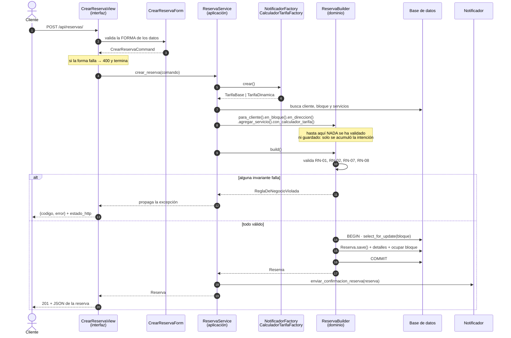
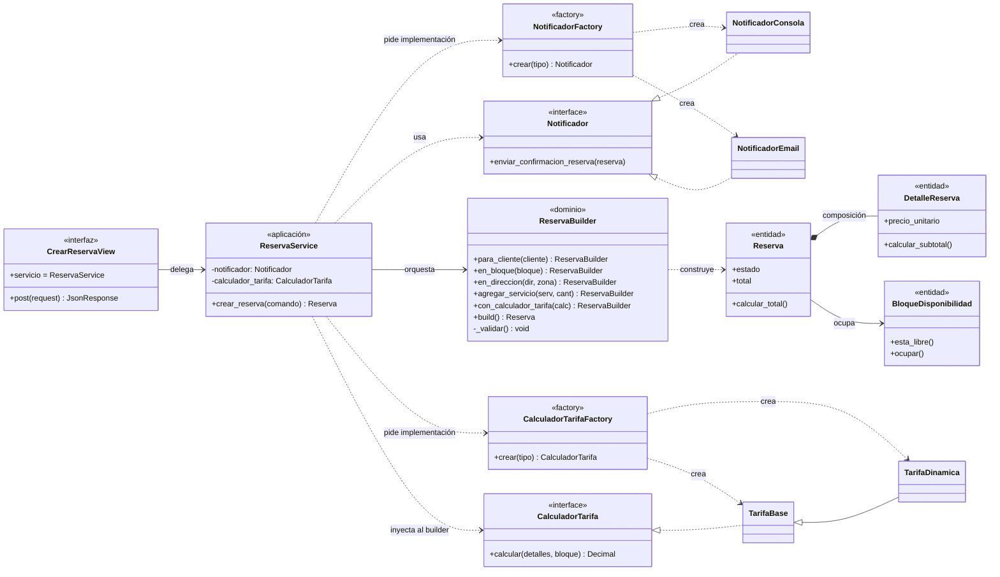

# Implementación del Patrón Creacional

> **Módulo:** Agenda y Reservas — caso de uso **Crear Reserva**
> **Proyecto:** CasaLista, marketplace de servicios profesionales para el hogar
> **Taller 01:** Refactorización Arquitectónica — Arquitectura de Software 2026

---

## 1. Por qué elegimos este flujo

De todo el sistema, *Crear Reserva* es el flujo que sostiene el negocio: es el
paso donde el cliente se compromete, donde se ocupa la agenda del profesional y
donde nace el dinero (sección 1.5 del Business Case). También era el más
enredado: concentraba **seis de las siete reglas de negocio** identificadas en la
sección 1.8 y tocaba cuatro entidades distintas en una sola operación.

Además, dos de los cuatro atributos de calidad priorizados dependen
directamente de él:

| Atributo | Riesgo si el flujo está mal construido |
|---|---|
| Consistencia de la agenda | Dos clientes reservan la misma franja |
| Modificabilidad | Cambiar la regla de tarifa obliga a tocar la vista |

---

## 2. El problema: la vista lo hacía todo

La primera implementación (commit `552cb77`) era una función de **116 líneas**
que mezclaba cuatro responsabilidades incompatibles:

```python
@require_POST
def crear_reserva(request):
    ...
    payload = json.loads(request.body or "{}")          # 1. parsing HTTP
    bloque = BloqueDisponibilidad.objects.get(pk=...)   # 2. acceso a datos
    ...
    if not profesional.verificado:                      # 3. reglas de negocio
        return JsonResponse({"error": "..."}, status=400)
    if zona.strip().lower() not in [...]:
        return JsonResponse({"error": "..."}, status=400)
    if bloque.estado != "LIBRE":
        return JsonResponse({"error": "..."}, status=409)
    ...
    total = Decimal("0.00")                             # 4. cálculo de tarifa
    for servicio, cantidad in servicios:
        total += servicio.precio_base * cantidad
    if bloque.inicio.hour >= 19 or bloque.inicio.hour < 7:
        total = total * Decimal("1.20")
    ...
    send_mail(...)                                      # 5. infraestructura
```

Consecuencias concretas, no teóricas:

- **No se podía probar sin HTTP.** Verificar la RN-07 exigía levantar un
  request completo.
- **Cambiar el correo por WhatsApp obligaba a editar la vista**, aunque
  notificar no tiene nada que ver con reservar.
- **No había transacción**: si `DetalleReserva.objects.create()` fallaba a mitad
  de camino, quedaba una reserva sin líneas y un bloque en estado inconsistente.
- **Trece `return JsonResponse` distintos** repartían las reglas por todo el
  cuerpo de la función.

---

## 3. La solución: cuatro capas con una sola dirección de dependencia

```
HTTP  ──▶  CrearReservaView   (interfaz)      ← no conoce reglas
           ReservaService     (aplicación)    ← conoce el algoritmo
           ReservaBuilder     (dominio)       ← conoce las invariantes
           Factories          (infraestructura)
```

La regla que ordena todo: **las capas de adentro nunca importan a las de
afuera**. `ReservaBuilder` no sabe que existe HTTP; `ReservaService` no sabe si
el correo se manda por SendGrid o se imprime en consola.

### Cómo interactúan la Vista, el Servicio y el Builder



Lo importante del diagrama está en el paso 8: **el Builder acumula y no valida**.
Toda la decisión de "esto puede existir o no" ocurre en un único punto,
`build()`, y ocurre **antes** de cualquier `.save()`.

### Diagrama de clases



Las flechas hacia `Notificador` y `CalculadorTarifa` son **punteadas y apuntan a
interfaces**: ahí está la Inversión de Dependencias. El servicio depende de un
contrato, no de `NotificadorEmail`.

---

## 4. Patrón Builder — `reservas/domain/reserva_builder.py`

Una `Reserva` no es un objeto plano: nace con líneas de detalle, con un total que
depende de una estrategia y ocupando un bloque de agenda. Con
`Reserva.objects.create(...)` quien llama tiene que acordarse del orden correcto
y de las siete validaciones. El Builder invierte esa carga.

### Interfaz fluida

```python
reserva = (ReservaBuilder()
           .para_cliente(cliente)
           .en_bloque(bloque)
           .en_direccion("Calle 30 #45-12", "Laureles")
           .agregar_servicio(servicio_fuga, cantidad=1)
           .agregar_servicio(servicio_sifon, cantidad=2)
           .con_calculador_tarifa(TarifaDinamica())
           .build())
```

Cada paso devuelve `self`, así que **el orden es indiferente** y el código se lee
como una frase. Hay una prueba dedicada a esto
(`test_los_pasos_son_encadenables_en_cualquier_orden`).

### Garantía de validez antes de `.save()`

`build()` cumple un contrato explícito:

```python
def build(self) -> Reserva:
    self._validar()                       # 1. TODAS las invariantes
    detalles = self._construir_detalles() # 2. objetos en memoria
    with transaction.atomic():
        self._bloque = BloqueDisponibilidad.objects.select_for_update().get(...)
        self._validar_disponibilidad_del_bloque()   # 3. recheck bajo bloqueo
        reserva = Reserva(...)
        self._asegurar_integridad_del_modelo(reserva)  # 4. full_clean()
        reserva.save()                    # 5. recién aquí se escribe
        ...
```

Invariantes que se verifican:

| Código | Regla | Excepción |
|---|---|---|
| RN-01 | El bloque está libre y sin reserva activa | `BloqueNoDisponible` |
| RN-01 | El bloque pertenece al profesional que atiende | `BloqueDeOtroProfesional` |
| RN-02 | Todos los servicios son del mismo profesional | `ServiciosDeDistintosProfesionales` |
| RN-07 | El profesional está verificado y cubre la zona | `ProfesionalNoHabilitado` |
| RN-08 | Los servicios caben en la duración de la franja | `DuracionExcedeBloque` |
| VAL-01…04 | Datos mínimos, cantidades, servicios activos | `DatosIncompletos`, … |

> **RN-08 es una regla derivada** que añadimos nosotros. El Business Case dice
> que cada servicio tiene duración estimada y que el bloque es una franja
> concreta; permitir 3 horas de trabajo en un bloque de 2 rompería la
> consistencia de la agenda al día siguiente.

### La decisión que más discutimos: `select_for_update()`

Validar la disponibilidad una sola vez deja una ventana de carrera: entre el
`if bloque.esta_libre()` y el `save()` otro cliente puede tomar la misma franja.
Como *consistencia de la agenda* es nuestro atributo de calidad #1, el Builder
**vuelve a leer el bloque bajo bloqueo dentro de la transacción** y repite la
verificación. Cuesta una consulta extra; compra la garantía de que la RN-01 no
se rompe bajo concurrencia.

---

## 5. Patrón Factory — `reservas/infra/factories.py`

El servicio necesita notificar y necesita calcular una tarifa, pero **no debe
decidir con qué**. Esa decisión es del entorno.

```python
class NotificadorFactory(FactoryPorEntorno):
    variable_de_entorno = "NOTIFICADOR_TYPE"
    valor_por_defecto = "MOCK"
    registro = {
        "MOCK": NotificadorConsola,   # imprime, no sale de la máquina
        "REAL": NotificadorEmail,     # envía con el backend de Django
    }
```

### Evidencia del cambio de comportamiento

```console
$ set NOTIFICADOR_TYPE=MOCK  &&  set TARIFA_TYPE=BASE  &&  python manage.py sembrar_demo

Implementaciones resueltas por las Factories:
  NOTIFICADOR_TYPE -> NotificadorConsola
  TARIFA_TYPE      -> TarifaBase
[NotificadorConsola] CasaLista - Reserva #1 creada
Reserva #1 creada | estado=PENDIENTE | total=$ 80000.00 | tarifa=BASE
```

```console
$ set NOTIFICADOR_TYPE=REAL  &&  set TARIFA_TYPE=DINAMICA  &&  python manage.py sembrar_demo

Implementaciones resueltas por las Factories:
  NOTIFICADOR_TYPE -> NotificadorEmail
  TARIFA_TYPE      -> TarifaDinamica
Subject: CasaLista - Reserva #3 creada
From: no-reply@casalista.co
To: ana@casalista.co
Fecha: 06/08/2026 20:00
Total: $ 96000.00
Reserva #3 creada | estado=PENDIENTE | total=$ 96000.00 | tarifa=DINAMICA
```

**No se editó una sola línea de código entre las dos ejecuciones.** El salto de
$80.000 a $96.000 es el recargo nocturno del 20 % que aplica `TarifaDinamica`;
el salto de `[NotificadorConsola]` al correo completo es la otra Factory.

Un valor desconocido no falla en silencio:

```python
NOTIFICADOR_TYPE=TELEPATIA → ImproperlyConfigured:
  "NOTIFICADOR_TYPE='TELEPATIA' no es un valor válido. Opciones: MOCK, REAL."
```

### Por qué dos Factories y no una

La primera (`NotificadorFactory`) resuelve una **dependencia externa**: efecto
de salida, I/O, algo que en pruebas no queremos ejecutar. La segunda
(`CalculadorTarifaFactory`) resuelve una **política de negocio**: cuál de las
estrategias de precio rige hoy. Son dos ejes de variación distintos y por eso
tienen dos variables de entorno distintas. Añadir `NotificadorWhatsApp` es
agregar una fila al `registro`, sin tocar el Service ni la Vista (Open/Closed).

---

## 6. Service Layer y la vista de 12 líneas

```python
class CrearReservaView(LoginRequiredMixin, View):
    """POST /api/reservas/ -> crea una reserva en estado PENDIENTE."""

    servicio = ReservaService  # inyectable: as_view(servicio=OtroService)

    def post(self, request, *args, **kwargs):
        formulario = CrearReservaForm(datos_del_request(request))
        if not formulario.is_valid():
            return JsonResponse({"errores": formulario.errors}, status=400)
        try:
            reserva = self.servicio().crear_reserva(formulario.a_comando(request.user.pk))
        except ReglaDeNegocioViolada as error:
            return JsonResponse(error.como_respuesta(), status=error.estado_http)
        return JsonResponse(serializar_reserva(reserva), status=201)
```

**12 líneas de código** (14 contando las líneas en blanco), frente a las 116 de
la versión monolítica. Y ni una sola regla de negocio: el código HTTP del error
lo aporta la propia excepción de dominio (`error.estado_http`), así que agregar
una regla nueva mañana **no toca este archivo**.

El servicio como atributo de clase es lo que habilita la inyección:

```python
CrearReservaView.as_view(servicio=ServicioDeMentira)   # usado en las pruebas
```

Y el `ReservaService` recibe sus colaboradores por constructor:

```python
def __init__(self, notificador=None, calculador_tarifa=None, builder_factory=ReservaBuilder):
    self.notificador = notificador or NotificadorFactory.crear()
    self.calculador_tarifa = calculador_tarifa or CalculadorTarifaFactory.crear()
```

El patrón `x or Factory.crear()` es deliberado: en producción manda el entorno;
en pruebas se inyecta un doble sin tocar variables de entorno ni la red.

---

## 7. Cumplimiento de SOLID

| Principio | Dónde se ve |
|---|---|
| **S** — Responsabilidad única | La vista traduce HTTP; el form valida forma; el Service orquesta; el Builder valida invariantes; el Notificador comunica. Cinco archivos, cinco razones de cambio. |
| **O** — Abierto/cerrado | Sumar `NotificadorWhatsApp` o `TarifaPorTemporada` = una clase nueva + una fila en el `registro`. Cero modificaciones en Service, Builder o Vista. |
| **L** — Sustitución de Liskov | `NotificadorConsola` y `NotificadorEmail` son intercambiables; las pruebas del Service corren con un `NotificadorEspia` que cumple el mismo contrato. |
| **I** — Segregación de interfaces | `Notificador` y `CalculadorTarifa` tienen **un** método cada uno. Nadie implementa métodos que no usa. |
| **D** — Inversión de dependencias | El dominio declara los puertos en `domain/puertos.py`; `infra/` provee los adaptadores. La flecha de dependencia apunta hacia adentro. |

---

## 8. Decisiones de diseño y sus costos

| Decisión | Alternativa descartada | Por qué |
|---|---|---|
| El Builder **persiste** dentro de `build()` | Devolver una `Reserva` sin guardar y que el Service la guarde | La reserva es un agregado: reserva + detalles + bloque ocupado deben entrar juntos o no entrar. Partirlo dejaba la transacción en manos del Service, que es justo lo que queríamos evitar. |
| Excepciones de dominio con `estado_http` | Que la vista mapee cada excepción a su código | Habría devuelto a la vista el conocimiento de las reglas. El costo es que el dominio "sabe" un número HTTP; lo aceptamos porque es un dato de presentación aislado en un atributo. |
| `CalculadorTarifa` inyectado **en el Builder** | Calcular el total en el Service | El total es una invariante de la reserva, no un paso del algoritmo. Si el Service lo calculara, se podría construir una reserva con un total incoherente. |
| Los modelos Django **son** las entidades | Entidades puras + mapeadores a modelos | Para un taller de 70 minutos el costo de mantener dos jerarquías paralelas no se paga. Lo compensamos manteniendo la lógica que cruza entidades fuera de `models.py`. |
| `domain/` importa `models` | Dominio 100 % libre de Django | Es la concesión consciente de este diseño. A cambio, `models.py` **no** importa nada de `infra/` ni de la vista, así que la dirección de dependencia sigue siendo sana. |

### Lo que quedó fuera (y por qué)

`Pago`, `Liquidación` y `Reseña` existen en el modelo de dominio de la
Actividad 1 pero **no se implementaron**: el taller pide refactorizar *una*
funcionalidad, y el flujo termina en `PENDIENTE`. La confirmación por pago
(RN-03) y la comisión (RN-06) son el siguiente caso de uso, y la arquitectura ya
tiene el lugar donde ponerlos: un `PagoService` y una `PasarelaPagoFactory`
junto a las actuales.

---

## 9. Verificación

39 pruebas automáticas respaldan lo anterior:

```console
$ python manage.py test reservas
Ran 39 tests in 71.240s

OK
```

| Archivo | Qué demuestra |
|---|---|
| `test_reserva_builder.py` | Una prueba por invariante (RN-01, RN-02, RN-07, RN-08) y que un fallo **no deja rastro** en la base. |
| `test_factories.py` | MOCK↔REAL y BASE↔DINAMICA conmutan solo con `override_settings`. |
| `test_reserva_service.py` | El Service acepta dobles inyectados y no notifica si la reserva falla. |
| `test_vista_crear_reserva.py` | 201, 400, 404, 409, 422 y que la vista funciona con un Service falso. |

---

## 10. Mapa de archivos

```
reservas/
├── views.py                       ← Capa de Interfaz (CBV, 12 líneas)
├── forms.py                       ← validación de forma
├── dto.py                         ← CrearReservaCommand
├── services.py                    ← Capa de Aplicación (Service Layer)
├── presenters.py                  ← dominio → JSON
├── models.py                      ← entidades
├── domain/                        ← Capa de Dominio
│   ├── reserva_builder.py         ★ PATRÓN BUILDER
│   ├── puertos.py                 ← interfaces (DIP)
│   ├── tarifas.py                 ← estrategias de precio
│   ├── excepciones.py             ← errores de negocio con código
│   └── dinero.py
├── infra/                         ← Capa de Infraestructura
│   ├── factories.py               ★ PATRÓN FACTORY
│   └── notificaciones.py          ← adaptadores MOCK / REAL
└── tests/                         ← 39 pruebas
```
