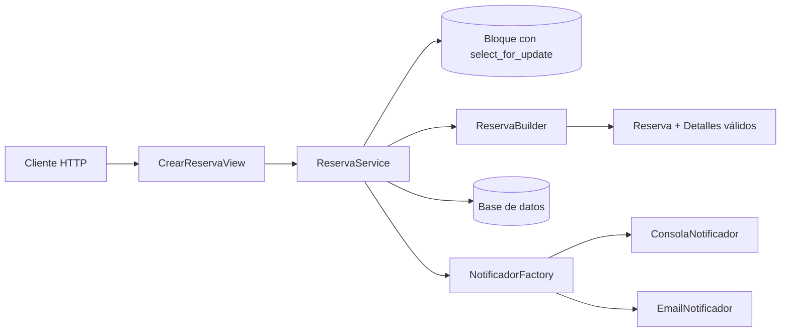
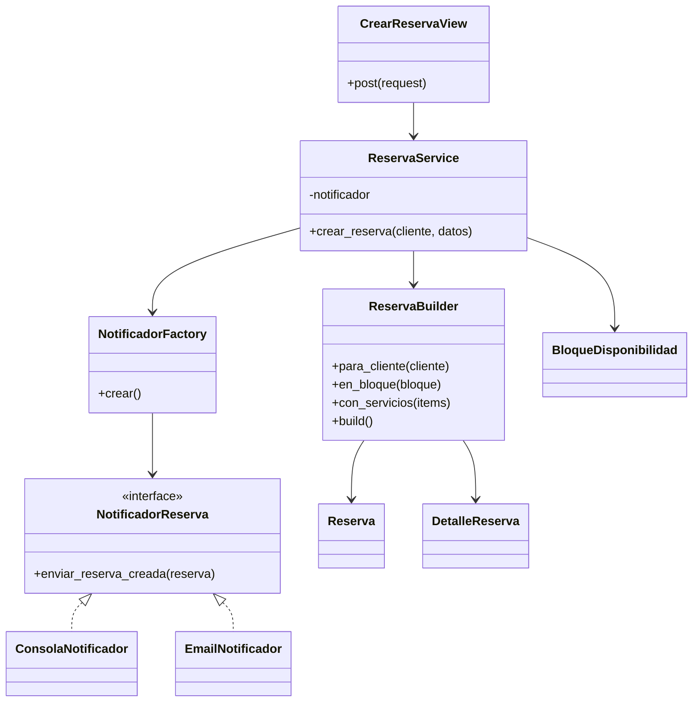

# Implementación del Patrón Creacional

## Módulo: creación de reservas

### Problema

La creación de una reserva reúne reglas que no deberían permanecer dentro de una vista:

- validar que el bloque siga libre;
- comprobar que el profesional esté verificado;
- verificar que todos los servicios pertenezcan al profesional del bloque;
- congelar el precio de cada servicio;
- calcular el total;
- guardar la reserva y sus detalles;
- ocupar el bloque;
- activar una notificación después de confirmar la transacción.

Una vista con todas estas decisiones tendría demasiados `if/else`, acceso directo a la base de datos y responsabilidades mezcladas.

## Solución arquitectónica

### 1. Capa de interfaz

`CrearReservaView` recibe el JSON, identifica al usuario autenticado, llama a `ReservaService` y convierte el resultado en una respuesta HTTP.

La vista no conoce cómo se calcula el total, cómo se validan los servicios, cómo se bloquea la agenda ni qué implementación de notificación se utiliza.

### 2. Service Layer

`ReservaService` representa el caso de uso **Crear Reserva**. Sus responsabilidades son de orquestación:

1. iniciar una transacción;
2. bloquear el registro de disponibilidad con `select_for_update()`;
3. consultar los servicios;
4. invocar el Builder;
5. persistir la reserva y los detalles;
6. ocupar el bloque;
7. solicitar la notificación con `transaction.on_commit()`.

El servicio recibe el notificador por el constructor. Esta inyección permite reemplazarlo en las pruebas sin modificar la lógica de negocio.

### 3. Builder

`ReservaBuilder` utiliza una interfaz fluida:

```python
construida = (
    ReservaBuilder()
    .para_cliente(cliente)
    .en_bloque(bloque)
    .con_servicios(items)
    .build()
)
```

Antes de devolver el objeto, verifica el cliente, el bloque, el profesional, los servicios, las cantidades y el total. El resultado contiene una `Reserva` y sus `DetalleReserva` todavía sin persistir. El Service Layer conserva el control de la transacción.

### 4. Factory

`NotificadorFactory` selecciona una implementación según `NOTIFICATION_BACKEND=CONSOLE` o `NOTIFICATION_BACKEND=EMAIL`. Así se cambia el comportamiento sin editar el Service Layer.

## Diagrama de interacción



## Diagrama de clases simplificado



## Aplicación de SOLID

- **Responsabilidad única:** la vista maneja HTTP; el servicio orquesta; el Builder construye; la Factory selecciona infraestructura.
- **Abierto/cerrado:** puede añadirse otro notificador sin modificar la vista ni el Builder.
- **Sustitución de Liskov:** las implementaciones cumplen el mismo contrato.
- **Segregación de interfaces:** el servicio depende de un contrato mínimo.
- **Inversión de dependencias:** el servicio recibe `NotificadorReserva` y en pruebas se inyecta `SpyNotificador`.

## Decisiones de diseño

### Bloqueo de concurrencia

`select_for_update()` se ejecuta dentro de `transaction.atomic()`. Además, una restricción condicional impide que un bloque aparezca en dos reservas activas.

### Precio congelado

`DetalleReserva.precio_unitario` copia el precio vigente. Un cambio posterior del catálogo no altera reservas ya creadas.

### Notificación posterior al commit

`transaction.on_commit()` evita enviar confirmaciones de transacciones fallidas.

## Resultado

La vista queda reducida a menos de quince líneas de lógica, las reglas se concentran en Builder y Service Layer, y la infraestructura cambia por configuración.
